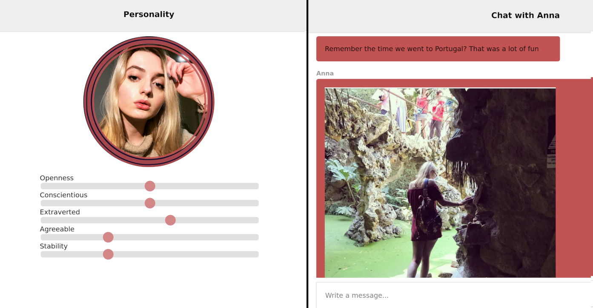

# MyEx.AI

A (fake) startup and app for building an Articifial Intelligence of your ex-partner,
using their public social media and private conversations you have had.

Purpose was to rise awareness of

* How much personal and sensitive data we put online, typically stored forever
* That it might not only be the social media companies we need to worry about data abuse from,
but also people that we (previously) trusted. Few practical methods today of 'revoking' such data access.
* That some aspects of emulating a person might not be so far off technologically.
Ex: Chatbot with personalized knowledge database and chatting style,
creating realistic fake images and videos by applying transformations ala [DeepFakes](https://www.youtube.com/watch?v=cQ54GDm1eL0)

Using a hopefully relatable example of something crazy-but-imaginable. 

Developed as part of MIT Medialab Berlin workshop
[Signal & Noise](https://www.media.mit.edu/events/mlberlin-signalandnoise/), under the Creative AI track
under the subtheme 'Immortality'.

### By

Adelina Badea, [Jasnam Sidhu](https://twitter.com/jasnam_sidhu), and [Jon Nordby](http://jonnor.com)

## Concept app
Just built to illustrate the idea. No real functionality.

### Setup

    npm install

### Run

    # Chat with conversations played back from ./data/scripts/
    npm start

    # Interactive mockups
    chromium personality.html
    chromium dataentry.html
    chromium processing.html

## Learnings

### Facebook API lockdown
Facebook has locked down API access for third-party apps considerably.
All apps that want to access anything but name,accountId must go through review,
including a screencast for each feature using a particular permission.
No (new) apps can access the Messenger inbox.

## Further work
NOT interested in developing this as a real app.
However, might be interested in:

### Tool for detecting sensitive data
Make a tool that lets users scan their FB,WhatApp conversations for sensitive data.
Because no matter how mindful one is about minimizing sensitive data online,
it is likely that some will leak in anyway.
Could be things that are intimate,embarrasing,secret.

Scanning should happen client-side in the users browser, so that it can be verified that no personal is collected.

Tool ideally assists in deleting the content as well. But need to make clear that there is no guarantee other
conversation participants don't have a copy/backup.

## More notes
See [presentation](./doc/presentation.md) and [braindump](./doc/braindump.md)
